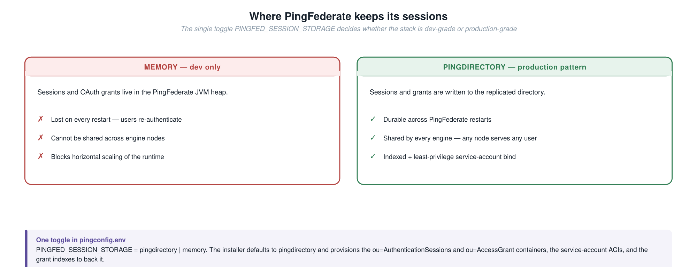
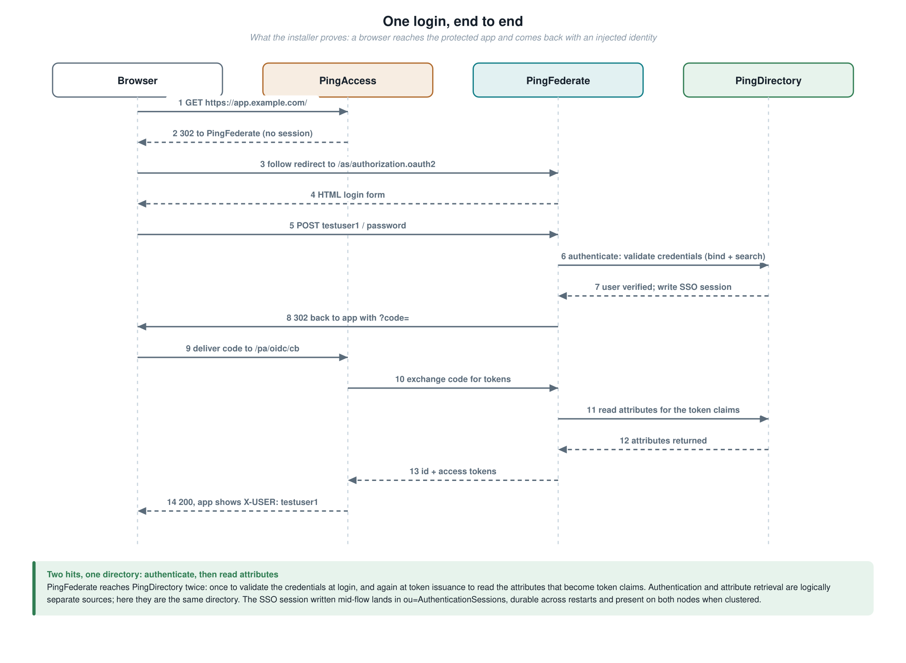
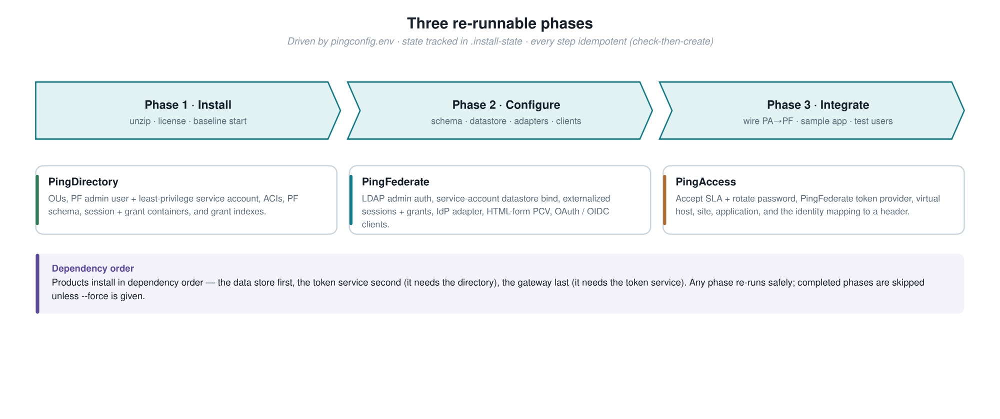
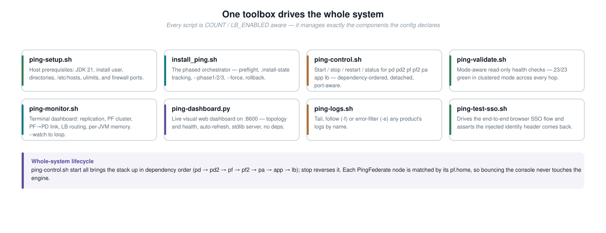

# Ping Installer: PingDirectory, PingFederate and PingAccess

An automated, phased installer that stands up a fully integrated Ping stack on a
single host and configures it the way a real customer runs it, including
externalized SSO session and OAuth grant storage in PingDirectory rather than in
memory.

It is modeled on the ForgeRock `ping_platform_installer`: three phase bash
orchestration, state tracking, and idempotent Admin API configuration.

---

## What it installs

| Order | Product | Version | Role in the stack |
|:-:|---|---|---|
| 1 | PingDirectory | 11.1.0.0 | LDAP user store, plus session and OAuth grant store |
| 2 | PingFederate | 13.1.1 | Federation, OAuth 2.0 and OIDC token service |
| 3 | PingAccess | 9.1.0 | Access gateway and reverse proxy (the enforcement point) |

Products install in dependency order: the data store first, the token service
second (it depends on the directory), and the gateway last (it depends on the
token service). Whether the stack is a single node or a highly available cluster is
set with one flag, `HA`, in `pingconfig.env`. The load balancer is always part of
the stack. See [Architecture](#architecture) below.

---

## Architecture

The shape of the deployment is driven by one flag, `HA`, in `pingconfig.env`. The
same scripts build either a single integrated node or a two node replicated and
clustered deployment. The orchestrator runs or skips PingDirectory replication,
PingFederate clustering, and the LDAPS and failover hardening to match. The load
balancer, an HAProxy front door on `:443`, is always part of the stack.

Whatever the scale, the logical integration is identical. A browser reaching a
protected app is redirected to PingFederate, which authenticates against
PingDirectory and persists the resulting session and OAuth grants back into
PingDirectory instead of holding them in memory.

### The topology


Both modes are the same shape. HAProxy is the single front door on `:443` and
routes by Host: `app.example.com` to PingAccess, `ping.example.com` to
PingFederate. PingAccess sits behind the load balancer and reaches PingFederate
*through* it, because its token-provider issuer is the load-balancer URL. It never
talks to an engine node directly, so failover and scaling are transparent.
PingFederate reaches PingDirectory directly over LDAPS. `HA` only sets how many
PingFederate and PingDirectory nodes sit behind the load balancer.

### HA=false (default)

One PingFederate and one PingDirectory behind the load balancer. The orchestrator
skips replication, PingFederate clustering, and the LDAPS failover hardening. The
integration, the externalized session and grant storage, and the login flow are
the same as HA=true.

### HA=true

Adds the second node of each (the dashed boxes above):

- PingDirectory: node 2 installs to its own directory and ports, joins node 1 with
  `dsreplication`, and is initialized from it. Writes replicate both ways. Grant
  indexes are created on each node because index config is not replicated.
- PingFederate: node 1 becomes the clustered console (the admin and config
  authority) and node 2 a clustered engine cloned from node 1 (shared `pf.jwk` and
  cluster key). Because sessions and grants are externalized to the replicated
  directory, the engine holds no state, so you can add more engines behind the load
  balancer to scale. Config is pushed from console to engine with
  `/cluster/replicate`.
- PingFederate to PingDirectory links: both connections are hardened to LDAPS with
  both directory nodes listed for failover, binding as the least-privilege
  `cn=pingfederate` service account. The path is encrypted and survives a node
  outage, which was checked by stopping node 1 mid flow: end user login and admin
  console login both kept working through node 2. The PingDirectory self signed
  certs carry the host IP in their SAN, so LDAPS targets the IP; a production
  deployment would issue certs with the service FQDN from a real CA.

These pieces are built by `pingdir/cluster_pingdir.sh`,
`pingfed/cluster_pingfed.sh`, `pingfed/secure_ha_datastore.sh`,
`bin/setup_loadbalancer.sh` and `bin/rewire_frontdoor.sh`, all invoked
automatically by the orchestrator when `HA=true`. This is a single host demo with
colocated, port offset instances; a real deployment puts one node per host on
identical ports.

### Why sessions live in PingDirectory

Sessions held in memory are lost on every PingFederate restart and cannot be shared
across engine nodes. Externalizing them to PingDirectory makes sessions durable and
ready for clustering, which is the standard production pattern, so the installer
always does it.



### One login, end to end

This is what the installer proves. A browser reaches the protected app, is bounced
through PingFederate to sign in against PingDirectory, and lands back on the app
carrying an injected identity header, with the SSO session written to the directory.
PingFederate reaches the directory twice along the way: once to validate the
credentials at login, and again at token issuance to read the attributes that become
the token claims. Authentication and attribute retrieval are logically separate
sources; here they are the same directory.



Details the installer bakes in to match a real customer:

- PingFederate reaches PingDirectory as a service account with least privilege
  (`cn=pingfederate,ou=applications,...`), not the directory root. ACIs grant it
  exactly what it needs: read on `ou=people`, read and write on the grant and
  session containers.
- The OAuth grant store is indexed in PingDirectory (equality on the grant lookup
  attributes, ordering on the expiry attribute) so lookups and cleanup stay backed
  by an index as the store grows.
- PingFederate admins authenticate against PingDirectory over LDAP, so the whole
  stack is provisioned with no first login setup wizard.

---

## Install flow

Everything is driven by `pingconfig.env` and runs in three phases that can be
rerun. Phase completion is tracked in `.install-state`, so reruns skip completed
phases unless `--force` is given. All configuration is idempotent (check then
create), so any phase is safe to run again.



### Step 1: create the install user

The whole stack installs and runs under one OS user that has sudo. On the target
host, create that user, give it sudo, log in as it, and set it in the config
before anything else. Every step after this runs as this user.

1. As root or an existing sudoer, create the user and grant it passwordless sudo:

   ```bash
   sudo useradd -m -s /bin/bash fradmin
   sudo usermod -aG wheel fradmin              # use 'sudo' instead of 'wheel' on Debian/Ubuntu
   echo 'fradmin ALL=(ALL) NOPASSWD: ALL' | sudo tee /etc/sudoers.d/fradmin
   sudo chmod 440 /etc/sudoers.d/fradmin
   ```

2. Log in as that user, and stay as this user from here on:

   ```bash
   sudo -iu fradmin
   ```

3. Put the installer where this user can read it, and set the user in the config:

   ```bash
   cd /path/to/ping_fed_installer
   sed -i 's/^INSTALL_USER=.*/INSTALL_USER="fradmin"/' pingconfig.env
   ```

### Step 2: quick start

Run every command below as the `fradmin` user from Step 1.

```bash
# 1. Stage the product zips and licenses under software/ (already present):
#      software/pd/PingDirectory-*.zip + *.lic
#      software/pf/pingfederate-*.zip   + *.lic
#      software/pa/pingaccess-*.zip     + *.lic

# 2. Set the hostnames and passwords in pingconfig.env (INSTALL_USER is already set)
vi pingconfig.env

# 3. Prerequisites: OpenJDK 21, the /ping directories, /etc/hosts, OS limits, firewall ports
./bin/ping-setup.sh

# 4. Install the whole stack
./bin/install_ping.sh --all
```

### Reinstall from scratch

To recover from a corrupted or partial install, or to rebuild after changing the
topology in `pingconfig.env`, use `--reinstall`. It stops the stack, removes the
product directories and `.install-state`, then runs all three phases fresh:

```bash
./bin/install_ping.sh --reinstall
```

On an interactive terminal it asks for confirmation first. A non interactive run
(a script or a remote runner) proceeds without prompting, so recovery stays a
single command. It does not restart services on failure, by design, so you can
deliberately break the running system to test failure scenarios and rebuild it when
you are ready.

### Operate



```bash
# Lifecycle for the whole system (both PD nodes, PF console and engine, PA, sample
# app, HAProxy), dependency ordered. Which components count as "all" follows the
# HA setting. Targets: pd pd2 pf pf2 pa app lb all
./bin/ping-control.sh start all
./bin/ping-control.sh restart pf2       # for example, bounce just the PF engine node
./bin/ping-control.sh status all

./bin/ping-control.sh start dash        # live web dashboard (auto refresh)
                                        #   http://<server>:8600/  (topology, replication,
                                        #   cluster, PF to PD link, LB routing, per JVM memory)
./bin/ping-monitor.sh                   # the same data in the terminal
./bin/ping-monitor.sh --watch 5
./bin/ping-validate.sh                  # health checks that adapt to the current mode
./bin/ping-logs.sh -f pf                # tail product logs (-f follow, -e errors)
./bin/ping-test-sso.sh                  # drive the login flow from end to end
```

> PingFederate takes a while to start (JVM and engine warm up). `ping-control.sh`
> starts it detached with `setsid` and waits on the port, so a slow start does not
> leave a half started process. It matches each PF node by its `pf.home`, so
> stopping the console never touches the engine, and the other way round.

---

## Accessing and testing the stack

### 1. Make the hostnames resolve

The stack uses the virtual hostnames `ping.example.com` (PingFederate) and
`app.example.com` (the protected app). On the install host they already map to
`127.0.0.1`. To reach it from a browser on another machine, add both names to that
machine's hosts file, pointing at the server IP:

```
# /etc/hosts (Linux or macOS)  or  C:\Windows\System32\drivers\etc\hosts
192.168.58.111  ping.example.com app.example.com
```

Every certificate is self signed, so browsers and curl will warn. Accept the
exception, or use `curl -k`.

Firewall: on RHEL and CentOS, firewalld is on by default and blocks every product
port to remote machines even though the services listen on all interfaces, so from
another host the admin consoles and the app time out. `./bin/ping-setup.sh` opens
the ports; to open them on their own run:

```bash
./bin/ping-setup.sh firewall      # opens 443, 9999, 9000, 9031, 9032, 3000, 1389, 1636, 1443 and more
```

### 2. Endpoints and credentials

The passwords below are the development `DEFAULT_PASSWORD` from `pingconfig.env`.
Change them before production.

| What | URL | Username | Password |
|---|---|---|---|
| Protected app, start here | `https://app.example.com/` | end user, below | |
| End user login (HTML form) | you are redirected to PingFederate | testuser1 to testuser5 | 2FederateM0re! |
| PingFederate admin console | `https://ping.example.com:9999/pingfederate/app` | pfadmin | 2FederateM0re! |
| PingAccess admin console | `https://ping.example.com:9000/` | administrator | 2FederateM0re! |
| PingDirectory (LDAP) | `ldap://ping.example.com:1389` (node 1), `:2389` (node 2) | cn=Directory Manager | 2FederateM0re! |
| OIDC discovery | `https://ping.example.com/.well-known/openid-configuration` | | |

> PingFederate admins sign in as an LDAP user in PingDirectory. pfadmin is
> provisioned there by the installer, not a native PingFederate account. There is
> deliberately no first login setup wizard.

### 3. Test the protected app (the main flow)

1. Browse to `https://app.example.com/`.
2. PingAccess sees no session and redirects you to the PingFederate login form.
3. Sign in as testuser1 with password 2FederateM0re!.
4. You land back on the app, which prints the injected identity header
   `X-USER: testuser1`. That is proof the full chain worked: PingAccess to
   PingFederate to PingDirectory, with the SSO session persisted to the directory,
   and everything going through the load balancer front door on `:443`.

### 4. Quick checks from the command line

```bash
# OIDC discovery. The issuer is the load balancer URL (no port) when a load balancer is on.
curl -sk https://ping.example.com/.well-known/openid-configuration \
  | python3 -m json.tool | grep -E 'issuer|authorization_endpoint'

# An unauthenticated app request returns 302 to PingFederate, which proves the PA to PF wiring.
curl -sk -D - -o /dev/null https://app.example.com/ | grep -i '^location'

# Whole stack health checks
./bin/ping-validate.sh
```

---

## Repository layout

```
ping_fed_installer/
├── pingconfig.env          # single source of truth: hosts, ports, licenses, storage mode, flags
├── lib/
│   ├── logging.sh          # shared CLI output (banners, steps, summary table)
│   └── rest_helpers.sh     # idempotent pf_* / pa_* Admin API verbs (basic auth + XSRF)
├── bin/
│   ├── install_ping.sh     # phased orchestrator (state, preflight, rollback, reinstall)
│   ├── ping-setup.sh       # host prerequisites (JDK, user, dirs, hosts, limits)
│   ├── ping-control.sh     # start/stop/restart/status the whole system (pd pd2 pf pf2 pa app lb)
│   ├── ping-monitor.sh     # terminal ops view: replication, cluster, PF to PD link, LB, RSS
│   ├── ping-dashboard.py   # live web dashboard (stdlib server; start via ping-control dash)
│   ├── ping-logs.sh        # tail, follow or error filter product logs
│   ├── ping-validate.sh    # read only stack health checks that adapt to the mode
│   ├── ping-test-sso.sh    # end to end login flow driver
│   ├── setup_loadbalancer.sh  # HAProxy front door (TLS termination) and cert
│   └── rewire_frontdoor.sh    # point the PF issuer and PA vhost at the load balancer URLs
├── pingdir/
│   ├── pingdir.sh              # Phase 1 install (extract, setup, start)
│   ├── configure_pingdir.sh   # Phase 2: OUs, PF admin user and group, service acct, ACIs,
│   │                          #          PF schema, session and grant containers, grant indexes
│   ├── cluster_pingdir.sh     # install node 2 and enable and initialize dsreplication
│   └── create_test_users.sh   # seed testuser1..N
├── pingfed/
│   ├── pingfed.sh                 # Phase 1 install (extract, license, start)
│   ├── configure_pingfed.sh       # Phase 2: LDAP admin auth, LDAP datastore (service acct bind),
│   │                              #          externalized session and grant storage, wizard bypass
│   ├── configure_pingfed_sso.sh   # Phase 2: PCV, HTML form IdP adapter, OAuth and OIDC clients and policy
│   ├── cluster_pingfed.sh         # console and engine cluster (clone node 2, replicate config)
│   └── secure_ha_datastore.sh     # switch PF to PD datastore to LDAPS with dual node failover
├── pingaccess/
│   ├── pingaccess.sh              # Phase 1 install (extract, license, start)
│   ├── configure_pingaccess.sh    # Phase 2: SLA and password rotate, PF token provider, vhost, site, app
│   └── sample-app.py              # stdlib backend that echoes injected identity headers
├── docs/images/            # README diagrams (generated PNG and SVG source)
├── tooling/                # diagram generator: svgkit.py, diagrams.py, make_diagrams.py
└── software/               # product zips and licenses (gitignored, user supplied)
    ├── pd/   pf/   pa/
```

> Diagrams are generated, not hand drawn. `python3 tooling/make_diagrams.py` writes
> the SVG sources and renders the PNGs the README embeds (it needs `rsvg-convert`
> from librsvg). Edit `tooling/diagrams.py`, never the SVGs.

---

## Configuration highlights (`pingconfig.env`)

| Variable | Purpose |
|---|---|
| `BASE_INSTALL_DIR` | where all three products install (default `/ping`) |
| `PING_HOSTNAME` | host that all services bind and advertise on a single node |
| `DEFAULT_PASSWORD` | shared admin and service password. Change it before production |
| `PINGFED_SESSIONS_BASE_DN` / `PINGFED_GRANTS_BASE_DN` | where PF writes sessions and grants in PD |
| `LDAP_BIND_DN` / `LDAP_BIND_PASSWORD` | the least privilege service account PF binds to PD as |
| `PINGFED_ADMIN_UID` | the LDAP user PF admins log in as (auth delegated to PD) |
| `HA` | topology, the one knob: `false` (default) is a single node of each product behind the load balancer, `true` is a two node replicated and clustered tier. The instance counts are derived from it (PingAccess is always single instance) |
| `INSTALL_SAMPLE_APP` / `INSTALL_TEST_USERS` | optional Phase 3 content (sample app, test users) |

Ports: PD LDAP 1389, LDAPS 1636 (the admin connector rides here), HTTPS 1443
(Admin API and SCIM), replication 8989 (only when `HA=true`). PF admin
9999, engine 9031. PA admin 9000, engine 3000, agent 3030.

> Development versus production: for convenience PingFederate binds PingDirectory
> over plaintext LDAP (`ldap://:1389`) and `dsconfig` trusts the self signed cert
> (`--trustAll`). For production, switch to LDAPS (`:1636`) with a real trust store.

---

## Status

Functionally complete and verified end to end on the reference host.

Installer:

- Orchestrator with three phases, `.install-state` tracking, preflight and rollback.
- `--reinstall` wipes and rebuilds in one command, for recovery from a corrupted or
  partial install or after a topology change.
- Phase 1 installs PingDirectory, PingFederate and PingAccess (extract, license, start).
- Phase 2 configures PingDirectory (content, schema, ACIs, grant indexes),
  PingFederate (LDAP admin auth, service account datastore bind, externalized
  sessions and grants, IdP adapter, OAuth and OIDC clients) and PingAccess (token
  provider, vhost, site, app, identity mapping).
- Phase 3 wires PingAccess to PingFederate, deploys the sample app, and seeds test users.

Verified in this build:

- Default topology (`HA=false`, a single node behind the load balancer): install
  completes, `ping-validate` reports 16 of 16, and the full browser login passes
  (authenticate, token exchange, the protected app returns the injected identity,
  and the session is persisted to PingDirectory).
- High availability (`HA=true`, two node PingDirectory replication, a PingFederate
  console and engine cluster, and the HAProxy front door): install completes,
  `ping-validate` reports 23 of 23, and the browser login passes end to end through
  the cluster.
- The `--reinstall` path was exercised repeatedly, wiping and rebuilding cleanly
  each time, including switching between the two topologies.

> License note: the supplied PingAccess license is `Version=9.0` while the software
> is `9.1.0`. PingAccess checks the license version at startup; in practice 9.1.0
> accepted the 9.0 development license here. All three licenses expire 2026-08-18.
