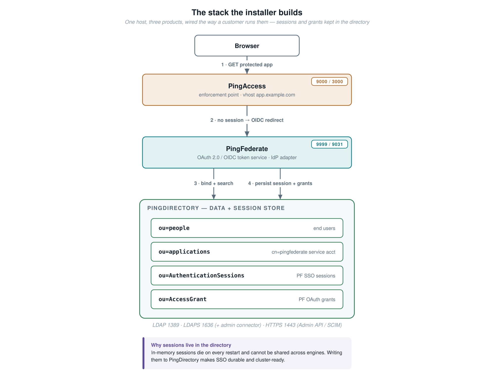
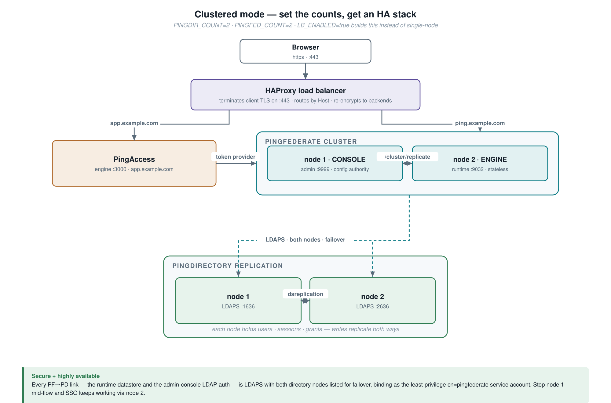

# Ping Installer — PingDirectory + PingFederate + PingAccess

An automated, phased installer that stands up a **fully integrated Ping stack** on a
single host and configures it the way a real customer runs it — including
**externalized SSO-session and OAuth-grant storage in PingDirectory** (not in memory).

Modeled structurally on the ForgeRock `ping_platform_installer` (three-phase bash
orchestration, state tracking, idempotent Admin-API configuration).

---

## What it installs

| Order | Product | Version | Role in the stack |
|:-:|---|---|---|
| 1 | **PingDirectory** | 11.1.0.0 | LDAP user store **+** session / OAuth-grant store |
| 2 | **PingFederate** | 13.1.1 | Federation, OAuth 2.0 / OIDC token service |
| 3 | **PingAccess** | 9.1.0 | Access gateway / reverse proxy (enforcement point) |

Products install in dependency order: the data store first, the token service
second (it depends on the directory), the gateway last (it depends on the token
service). How many of each, and whether a load balancer fronts them, is set in
`pingconfig.env` — see [Architecture](#architecture) below. The shipped config
builds the highly available topology (`PINGDIR_COUNT=2`, `PINGFED_COUNT=2`,
`LB_ENABLED=true`); set the counts to 1 and `LB_ENABLED=false` for a single node.

---

## Architecture

The architecture is **driven entirely by `pingconfig.env`**. The same scripts build
either a clustered, load-balanced, highly available deployment or a single
integrated node — the orchestrator runs, or skips, PingDirectory replication,
PingFederate clustering, the LDAPS/failover hardening and the load balancer to
match the instance counts and the `LB_ENABLED` flag. The rest of this section
assumes the highly available shape (the shipped default); [the simpler single-node
option](#simpler-a-single-node) is the same stack with those pieces switched off.

Whatever the scale, the **logical integration is identical** — a browser reaching a
protected app is redirected to PingFederate, which authenticates against
PingDirectory and **persists the resulting session + OAuth grants back into
PingDirectory** rather than holding them in memory:



### Highly available (the shipped default)

```bash
PINGDIR_COUNT=2      # 2-node PingDirectory replication
PINGFED_COUNT=2      # PingFederate console + engine cluster
LB_ENABLED=true      # HAProxy front door on :443 — installed automatically
```



- **PingDirectory** — node 2 installs to its own dir/ports, joins node 1 via
  `dsreplication`, and is initialized from it; writes replicate both ways. Grant
  indexes are created on each node (index config isn't replicated).
- **PingFederate** — node 1 becomes `CLUSTERED_CONSOLE` (admin/config authority),
  node 2 a `CLUSTERED_ENGINE` cloned from node 1 (shared `pf.jwk` + cluster key)
  serving OAuth/OIDC runtime. Because sessions and grants are externalized to the
  replicated directory, the engine is stateless — add more engines behind the LB
  to scale. Config is pushed console→engine via `/cluster/replicate`.
- **PingFederate → PingDirectory links** — in clustered mode **both** PF→PD
  connections are hardened: the **runtime datastore** (user auth, sessions,
  grants) *and* the **admin-console LDAP auth** (`bin/ldap.properties`) are
  switched to **LDAPS** (PD's certs imported into PF's trusted-CA store,
  `verifyHost` on) with **both** directory nodes listed for failover, and both use
  the least-privilege `cn=pingfederate` service account. So the PF→PD path is
  encrypted *and* survives a node outage — verified by stopping node 1 mid-flow:
  end-user SSO **and** admin-console login both kept working via node 2. Built by
  `pingfed/secure_ha_datastore.sh`. The PD self-signed certs carry the host IP
  (not `ping.example.com`) in their SAN, so LDAPS targets the IP; a production
  deployment would issue PD certs with the service FQDN from a real CA.
- **Load balancer** — HAProxy is **installed automatically** when `LB_ENABLED=true`
  (via the host package manager), then configured to terminate client TLS on `:443`
  and route by Host to the PingFederate runtime (`ping.example.com`) and PingAccess
  (`app.example.com`), re-encrypting to the HTTPS backends. The OIDC issuer and app
  URLs are rewired to the LB (no port), so the entire SSO flow transits the front
  door. The backend points at whichever PingFederate engine port is actually live,
  so the same front door fronts a single node or a cluster.

Built by `pingdir/cluster_pingdir.sh`, `pingfed/cluster_pingfed.sh`,
`pingfed/secure_ha_datastore.sh`, `bin/setup_loadbalancer.sh` and
`bin/rewire_frontdoor.sh` — all invoked automatically by the orchestrator when the
counts / `LB_ENABLED` warrant. This is a single-host demo (co-located, port-offset);
real deployments put one node per host on identical ports.

### Simpler: a single node

Set the counts to 1 and disable the load balancer:

```bash
PINGDIR_COUNT=1
PINGFED_COUNT=1
LB_ENABLED=false
```

The orchestrator skips replication, PingFederate clustering, the LDAPS/failover
hardening and the load balancer entirely — PingFederate serves OIDC directly on
`:9031` and PingAccess on `:3000`. The integration, the externalized session and
grant storage, and the end-to-end SSO flow are all identical. You can also put a
single node **behind** the load balancer (`LB_ENABLED=true` with the counts at 1):
the front door still works, because its backend targets the live engine's port.

### Why sessions live in PingDirectory

In-memory sessions are lost on every PingFederate restart and cannot be shared
across engine nodes. Externalizing them to PingDirectory makes sessions durable and
cluster-ready — the standard production customer pattern. Toggle with
`PINGFED_SESSION_STORAGE` in `pingconfig.env` (`pingdirectory` | `memory`).


### One login, end to end

This is what the installer proves: a browser reaches the protected app, is bounced
through PingFederate to sign in against PingDirectory, and lands back on the app
carrying an injected identity header — with the SSO session written to the directory.


**Customer-realistic details** the installer bakes in:
- PingFederate reaches PingDirectory as a **least-privilege service account**
  (`cn=pingfederate,ou=applications,…`), not the directory root. ACIs grant it
  exactly what it needs: read on `ou=people`, read/write on the grant + session
  containers.
- The OAuth grant store is **indexed** in PingDirectory (equality on the grant
  lookup attributes, ordering on the expiry attribute) so lookup and cleanup stay
  index-backed as the store grows.
- PingFederate admins authenticate against PingDirectory over LDAP (no in-product
  native admin), so the whole stack is provisioned headlessly with no first-login
  setup wizard.

---

## Install flow

Everything is driven by `pingconfig.env` and run in three re-runnable phases.
Phase completion is tracked in `.install-state`; re-runs skip completed phases
unless `--force` is given. All configuration is idempotent (check-then-create),
so any phase can be safely re-run.


### Quick start

```bash
# 1. Drop product zips + licenses into software/ (already present):
#      software/pd/PingDirectory-*.zip + *.lic
#      software/pf/pingfederate-*.zip   + *.lic
#      software/pa/pingaccess-*.zip     + *.lic

# 2. Review and edit configuration (hosts, ports, passwords, storage mode)
vi pingconfig.env

# 3. Prepare the host (JDK 21, install user, directories, /etc/hosts, limits)
./bin/ping-setup.sh

# 4. Install everything
./bin/install_ping.sh --all

# ...or one phase at a time
./bin/install_ping.sh --phase1
./bin/install_ping.sh --phase2 --force
```

### Operate


```bash
# Lifecycle for the WHOLE system (both PD nodes, PF console+engine, PA, sample
# app, HAProxy) — dependency-ordered; which components are "all" follows the
# *_COUNT / LB_ENABLED settings. Targets: pd pd2 pf pf2 pa app lb all
./bin/ping-control.sh start all
./bin/ping-control.sh restart pf2       # e.g. bounce just the PF engine node
./bin/ping-control.sh status all

./bin/ping-control.sh start dash        # live VISUAL web dashboard (auto-refresh)
                                        #   -> http://<server>:8600/  (topology, replication,
                                        #      cluster, PF->PD link, LB routing, per-JVM memory)
./bin/ping-monitor.sh                   # same data, terminal: replication, cluster,
./bin/ping-monitor.sh --watch 5         #   PF->PD link, LB routing, per-JVM RSS
./bin/ping-validate.sh                  # mode-aware health checks (23/23 clustered)
./bin/ping-logs.sh -f pf                # tail product logs (-f follow, -e errors)
./bin/ping-test-sso.sh                  # drive the end-to-end browser SSO flow
```

> PingFederate takes a while to start (JVM + engine warm-up). `ping-control.sh`
> starts it detached (`setsid`) and waits on the port, so a slow start won't
> leave a half-started process. It matches each PF node by its `pf.home`, so
> stopping the console never touches the engine (and vice-versa).

---

## Accessing & testing the stack

### 1. Make the hostnames resolve

The stack uses the virtual hostnames `ping.example.com` (PingFederate) and
`app.example.com` (the protected app). On the install host they already map to
`127.0.0.1`. To reach it from a browser on **another machine**, add both names to
*that machine's* hosts file, pointing at the server's IP:

```
# /etc/hosts (Linux/macOS)  or  C:\Windows\System32\drivers\etc\hosts
192.168.58.111  ping.example.com app.example.com
```

Every certificate is self-signed, so browsers/`curl` will warn — accept the
exception (or use `curl -k`).

**Firewall:** on RHEL/CentOS, `firewalld` is on by default and blocks every
product port to remote machines even though the services listen on all
interfaces — so from another host the admin consoles and app just time out.
`./bin/ping-setup.sh` opens the stack's ports; to (re)open them on their own run:

```bash
./bin/ping-setup.sh firewall      # opens 443/9999/9000/9031-9032/3000/1389/1636/1443/…
```

### 2. Endpoints & credentials

The passwords below are the dev `DEFAULT_PASSWORD` from `pingconfig.env` —
**change them before production.**

| What | URL | Username | Password |
|---|---|---|---|
| **Protected app** — start here | clustered+LB: `https://app.example.com/`<br>single-node: `https://app.example.com:3000/` | *(end-user, below)* | |
| End-user login (HTML form) | *(you're redirected to PingFederate)* | `testuser1` … `testuser5` | `2FederateM0re!` |
| PingFederate admin console | `https://ping.example.com:9999/pingfederate/app` | `pfadmin` | `2FederateM0re!` |
| PingAccess admin console | `https://ping.example.com:9000/` | `administrator` | `2FederateM0re!` |
| PingDirectory (LDAP) | `ldap://ping.example.com:1389` (node&nbsp;1) · `:2389` (node&nbsp;2) | `cn=Directory Manager` | `2FederateM0re!` |
| OIDC discovery | clustered+LB: `https://ping.example.com/.well-known/openid-configuration`<br>single-node: `https://ping.example.com:9031/.well-known/openid-configuration` | — | — |

> PingFederate admins sign in as an **LDAP user in PingDirectory** — `pfadmin` is
> provisioned there by the installer, not a native PingFederate account. There is
> deliberately no first-login setup wizard.

### 3. Test the protected app (the main flow)

1. Browse to **`https://app.example.com/`** (clustered+LB) or
   **`https://app.example.com:3000/`** (single-node).
2. PingAccess sees no session and redirects you to the PingFederate login form.
3. Sign in as **`testuser1` / `2FederateM0re!`**.
4. You land back on the app, which prints the injected identity header
   **`X-USER: testuser1`** — proof the full chain worked: PingAccess → PingFederate
   → PingDirectory, with the SSO session persisted to the directory (and, in
   clustered mode, everything transiting the load balancer on `:443`).

### 4. Quick checks from the command line

```bash
# OIDC discovery — issuer is the LB URL (no port) in clustered mode
curl -sk https://ping.example.com/.well-known/openid-configuration \
  | python3 -m json.tool | grep -E 'issuer|authorization_endpoint'

# Unauthenticated app request -> 302 to PingFederate (proves PA->PF wiring)
curl -sk -D - -o /dev/null https://app.example.com/ | grep -i '^location'

# Whole-stack health: 13 read-only checks
./bin/ping-validate.sh
```

---

## Repository layout

```
ping_fed_installer/
├── pingconfig.env          # single source of truth: hosts, ports, licenses, storage mode, flags
├── lib/
│   ├── logging.sh          # shared CLI output (banners, steps, summary table)
│   └── rest_helpers.sh     # idempotent pf_* / pa_* Admin-API verbs (basic auth + XSRF)
├── bin/
│   ├── install_ping.sh     # phased orchestrator engine (state / preflight / rollback)
│   ├── ping-setup.sh       # host prerequisites (JDK, user, dirs, hosts, limits)
│   ├── ping-control.sh     # start/stop/restart/status the whole system (pd pd2 pf pf2 pa app lb)
│   ├── ping-monitor.sh     # terminal ops dashboard: replication, cluster, PF->PD link, LB, RSS
│   ├── ping-dashboard.py   # live VISUAL web dashboard (stdlib server; start via ping-control dash)
│   ├── ping-logs.sh        # tail / follow / error-filter product logs
│   ├── ping-validate.sh    # mode-aware read-only stack health checks
│   ├── ping-test-sso.sh    # end-to-end SSO flow driver
│   ├── setup_loadbalancer.sh  # HA: HAProxy front door (TLS termination) + cert
│   └── rewire_frontdoor.sh    # HA: point PF issuer / PA vhost at the LB URLs
├── pingdir/
│   ├── pingdir.sh              # Phase 1 install (extract, setup, start)
│   ├── configure_pingdir.sh   # Phase 2: OUs, PF admin user/group, service acct, ACIs,
│   │                          #          PF schema + session/grant containers, grant indexes
│   ├── cluster_pingdir.sh     # HA: install node 2 + dsreplication enable/initialize
│   └── create_test_users.sh   # seed testuser1..N
├── pingfed/
│   ├── pingfed.sh                 # Phase 1 install (extract, license, start)
│   ├── configure_pingfed.sh       # Phase 2: LDAP admin auth, LDAP datastore (svc-acct bind),
│   │                              #          externalized session/grant storage, setup-wizard bypass
│   ├── configure_pingfed_sso.sh   # Phase 2: PCV, HTML-form IdP adapter, OAuth/OIDC clients + policy
│   ├── cluster_pingfed.sh         # HA: console+engine cluster (clone node 2, replicate config)
│   └── secure_ha_datastore.sh     # HA: switch PF->PD datastore to LDAPS + dual-node failover
├── pingaccess/
│   ├── pingaccess.sh              # Phase 1 install (extract, license, start)
│   ├── configure_pingaccess.sh    # Phase 2: SLA/password rotate, PF token provider, vhost/site/app
│   └── sample-app.py              # stdlib backend that echoes injected identity headers
├── docs/images/            # README diagrams (generated PNG + SVG source)
├── tooling/                # diagram generator — svgkit.py, diagrams.py, make_diagrams.py
└── software/               # product zips + licenses  (gitignored, user-supplied)
    ├── pd/   pf/   pa/
```

> **Diagrams** are generated, not hand-drawn: `python3 tooling/make_diagrams.py`
> writes the SVG sources and renders the PNGs the README embeds (needs
> `rsvg-convert` from librsvg). Edit `tooling/diagrams.py`, never the SVGs.

---

## Configuration highlights (`pingconfig.env`)

| Variable | Purpose |
|---|---|
| `BASE_INSTALL_DIR` | where all three products install (default `/ping`) |
| `PING_HOSTNAME` | host all services bind/advertise (single-node) |
| `DEFAULT_PASSWORD` | shared admin/service password — **change before production** |
| `PINGFED_SESSION_STORAGE` | `pingdirectory` (externalized) or `memory` (dev) |
| `PINGFED_SESSIONS_BASE_DN` / `PINGFED_GRANTS_BASE_DN` | where PF writes sessions / grants in PD |
| `LDAP_BIND_DN` / `LDAP_BIND_PASSWORD` | least-privilege service account PF binds to PD as |
| `PINGFED_ADMIN_UID` | LDAP user PF admins log in as (auth delegated to PD) |
| `PINGDIR_COUNT` / `PINGFED_COUNT` | instance counts — 1 for single-node, 2 for a replicated / clustered tier (PingAccess is single-instance) |
| `INSTALL_SAMPLE_APP` / `INSTALL_TEST_USERS` / `INSTALL_OIDC_CLIENT` | optional Phase 3 content |

Ports: PD LDAP 1389 / LDAPS 1636 (admin connector rides here) / HTTPS 1443
(Admin API + SCIM) / replication 8989 (only when `PINGDIR_COUNT > 1`) · PF admin
9999 / engine 9031 · PA admin 9000 / engine 3000 / agent 3030.

> **Dev vs. prod:** for developer convenience PF binds PingDirectory over
> plaintext LDAP (`ldap://:1389`) and `dsconfig` trusts the self-signed cert
> (`--trustAll`). For production, switch to LDAPS (`:1636`) with a real trust
> store.

---

## Status

**Functionally complete and proven end-to-end on the reference host.**

- ✅ Project scaffold, `pingconfig.env`, `lib/logging.sh`, `lib/rest_helpers.sh`
- ✅ Orchestrator engine (`bin/install_ping.sh`) — phases, `.install-state`,
  preflight, rollback
- ✅ Phase 1 install — PingDirectory, PingFederate, PingAccess extracted,
  licensed, started
- ✅ Phase 2 configure — PD content/schema/ACIs + grant indexes; PF LDAP admin
  auth, service-account datastore bind, externalized sessions + grants, IdP
  adapter, OAuth/OIDC clients; PA token provider, vhost/site/app/identity mapping
- ✅ Phase 3 integrate — PA → PF wiring, sample protected app, test users;
  **browser SSO proven end-to-end** with the SSO session and OAuth grant landing
  in PingDirectory
- ✅ Operator scripts — control / logs / validate / test-sso (`ping-validate.sh`
  currently reports 13/13)
- ✅ **Clustered / HA mode** — 2-node PingDirectory replication, PingFederate
  console+engine cluster, and an HAProxy front door terminating TLS on :443, all
  COUNT/`LB_ENABLED`-driven. Verified end-to-end: browser SSO through the load
  balancer returns the injected identity header, and the engine-written auth
  session is present on **both** replicated directory nodes

> **License note:** the supplied PingAccess license is `Version=9.0` while the
> software is `9.1.0`. PingAccess validates license version at startup; in
> practice 9.1.0 accepted the 9.0 development license here. All three licenses
> expire **2026-08-18**.
